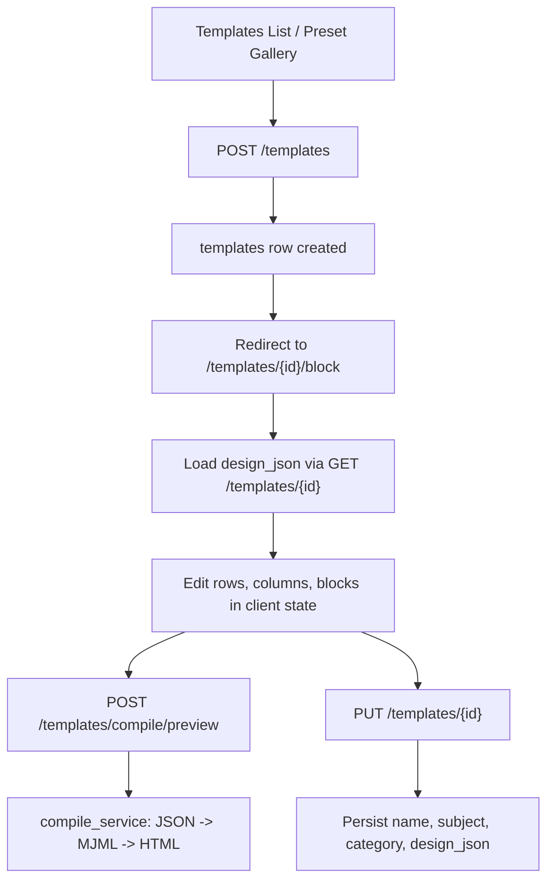
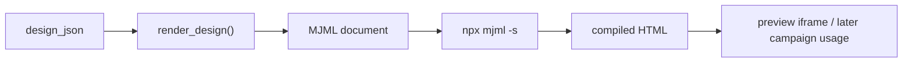

# Phase 3 - Template Engine

> Verification status: Verified against code
> Last reviewed: March 15, 2026
> Overall status: Implemented and usable, but only partially complete against the original Phase 3 checklist

## Purpose

Phase 3 establishes the template-authoring layer of the platform. This is the phase where the product moves from contact storage into message composition:

- create and manage reusable email templates
- author templates with a structured editor
- render structured content into MJML and then HTML
- preview responsive output before campaign use
- provide the template base that later phases use for campaign composition and delivery

The template subsystem is real and operational in code today. The main problem is documentation drift. Older docs still describe the wrong subsystem, overstate GrapesJS as the active editor, and mark incomplete items as done.

## What Phase 3 Actually Builds

The current codebase implements Phase 3 as a structured block-template system:

1. A user opens the templates list and can start from a blank canvas or a preset.
2. The frontend creates a `templates` row through the backend API.
3. The user is redirected into the structured block editor at `/templates/{id}/block`.
4. The editor loads `design_json`, lets the user arrange rows, columns, and content blocks, and can call a preview compile endpoint.
5. The backend converts `design_json -> MJML -> HTML` using the MJML CLI.
6. The user saves template metadata and structured design state back to the database.
7. Templates can later be selected by campaigns.

This is not primarily an HTML editor phase anymore. The active implementation is a JSON-driven template builder with server-side HTML compilation.

## Architecture

### Backend stack

- FastAPI routes under `platform/api/routes/templates.py`
- Supabase/PostgreSQL accessed through the service-role client
- template persistence in `TemplateService`
- structured schema validation in `platform/api/models/template.py`
- backend compilation in `platform/api/services/compile_service.py`
- MJML CLI invoked through `npx mjml`

### Frontend stack

- Next.js app router pages under `platform/client/src/app/templates`
- templates list page with preset gallery
- `new` route for blank-template creation
- active structured block editor under `/templates/[id]/block`
- legacy routes that redirect to the block editor

### Data model

The active runtime model is:

- `templates.id`
- `templates.tenant_id`
- `templates.name`
- `templates.subject`
- `templates.category`
- `templates.mjml_json`
- `templates.mjml_source`
- `templates.compiled_html`
- `templates.plain_text`
- `templates.version`
- timestamps

Important runtime detail:

- the active structured editor stores `design_json` inside `mjml_json.design_json`
- this is a compatibility/storage shortcut, not a clean dedicated `design_json` column
- the API unpacks that nested value back into `design_json` for the frontend

## Runtime Flow

## Template Editor Architecture

## What Is Implemented

### 1. Template CRUD

Verified backend routes:

- `POST /templates/`
- `GET /templates/`
- `GET /templates/{template_id}`
- `PUT /templates/{template_id}`
- `DELETE /templates/{template_id}`
- `POST /templates/compile/preview`

`TemplateService` provides:

- create
- list with pagination
- get by id
- update
- delete
- response unpacking for `design_json`

Tenant isolation is application enforced via `require_active_tenant` and `tenant_id` filtering on template CRUD routes.

### 2. Structured block editor

The active editor is:

- `platform/client/src/app/templates/[id]/block/page.tsx`

What it supports:

- row presets
- block palette
- drag-and-drop block movement
- row ordering
- desktop/mobile preview mode
- block duplication and deletion
- row deletion
- property inspector for content and style fields
- save and preview actions

The content model is structured around:

- rows
- columns
- blocks

Supported block types include:

- text
- image
- button
- divider
- spacer
- social
- hero
- footer

### 3. Preset-driven creation

The templates list page provides a preset gallery backed by `templatePresets.ts`.

What is true:

- a preset gallery exists
- a blank canvas option exists
- selecting a preset creates a template row and redirects into the block editor

What is not true:

- presets are frontend-defined starter designs, not a backend-managed preset catalog

### 4. Server-side compile preview

`POST /templates/compile/preview` calls backend compilation.

The compile stack is:

- `design_json` rendered to MJML through recursive Python renderers
- MJML compiled to responsive HTML via `npx mjml`

This is the correct architectural direction for email output because it keeps HTML generation on the backend and leverages MJML for email-client-safe markup.

### 5. Routing cleanup toward the block editor

Current route behavior:

- `/templates/[id]` redirects to `/templates/[id]/block`
- `/templates/[id]/editor` redirects to `/templates/[id]/block`

This means the structured block editor is the intended default editing experience.

## What Is Partially Implemented

### Compiled HTML storage

The schema and service layer support `compiled_html`, but the active block-editor save path does not keep it in sync.

Current reality:

- create requests store placeholder HTML such as `
Loading…
`
- preview compiles HTML on demand
- block-editor save currently sends `name`, `subject`, and `design_json`
- `compiled_html` is only updated if explicitly passed in the request

So Phase 3 should not be described as having a fully operational "persist compiled HTML on every save" flow.

### Plain text support

The model and DB field exist, but the product flow is incomplete.

Current reality:

- `plain_text` exists in the schema and API models
- there is no verified auto-generation route wired into template save
- there is no plain-text editor tab in the current frontend

### Legacy GrapesJS path

There is still legacy/editor drift in the codebase:

- `platform/client/src/app/templates/[id]/builder/page.tsx` still contains a GrapesJS implementation
- `platform/client/src/components/GrapesJSEditor.tsx` is only a stub telling users to use the block editor

This means GrapesJS still exists in code, but it is not the active, first-class Phase 3 editor architecture.

## What Is Not Implemented

- template version history and restore flow
- duplicate-template API flow
- category filter tabs on the templates list page
- public view-online rendering without login
- test-email send flow from the template editor
- plain-text auto-generation and manual override UI
- placeholder or merge-tag guide in the editor
- backend endpoint for duplicate even though the frontend tries to call one

## Important Code Truths

### Duplicate button mismatch

The templates list page tries to call:

- `POST /templates/{id}/duplicate`

But the backend route does not exist. This is a verified frontend-backend mismatch and should remain marked incomplete.

### Hardcoded API base URLs remain in templates frontend

Different templates pages use hardcoded values such as:

- `http://127.0.0.1:8000`
- `http://localhost:8000`

while the block editor also supports `NEXT_PUBLIC_API_URL`.

This is a real configuration inconsistency and should be treated as technical debt.

### Preview endpoint is compile-only

The preview endpoint currently:

- compiles HTML
- returns raw HTML

It does not:

- persist compiled HTML
- store preview history
- return preflight warnings, even though `compile_service.py` includes `run_preflight_checks()`

That means the preflight warning logic exists in code but is not yet wired into the active API or UI flow.

## Completion Matrix

| Area | Status | Notes |
|---|---|---|
| Template CRUD | Implemented | Backend routes and service layer are real |
| Preset gallery | Implemented | Frontend-defined preset designs |
| Blank-template creation | Implemented | Redirects into block editor |
| Structured block editor | Implemented | Active primary editor |
| Server-side compile preview | Implemented | JSON -> MJML -> HTML |
| Persist compiled HTML from active editor | Partial | Schema exists, save path not synced |
| Plain text support | Partial | Field exists, no complete UI or generation flow |
| GrapesJS as active editor | Not current | Legacy path remains but is not primary |
| Duplicate template flow | Not implemented | Frontend button exists, backend route missing |
| Version history | Not implemented | No restore/history subsystem |
| Public view-online page | Not implemented | No verified route |
| Test email from editor | Not implemented | No verified route/UI |

## Recommendations

1. Make the block editor the single source of truth and formally deprecate the legacy GrapesJS builder route.
2. Compile and persist `compiled_html` on block-editor save so campaigns always consume current output.
3. Either implement `POST /templates/{id}/duplicate` or remove the duplicate button until the backend exists.
4. Replace hardcoded API base URLs with `NEXT_PUBLIC_API_URL` consistently.
5. Expose `run_preflight_checks()` through the preview/save flow so users see size, unsubscribe, and spam-risk warnings before campaigns use a template.
6. Add template versioning only after the active editor data model is stable.

## Bottom Line

Phase 3 is real and usable. The product already has a working template subsystem centered on a structured block editor and server-side MJML compilation.

But it is not complete against the original checklist, and the previous docs were materially inaccurate. The correct status is:

- core template engine: implemented
- active editor path: structured block editor
- operational completeness against original Phase 3 promise: partial

---
## Technical Appendix (Engineering view)
- Tables: templates, template_versions (history), categories.
- Endpoints: /templates CRUD, /templates/{id}/preview (server compile).
- Editor: block/canvas UI (GrapesJS planned) with server-side preview.
- Files: platform/api/routes/templates.py, platform/client/src/app/templates/*.
