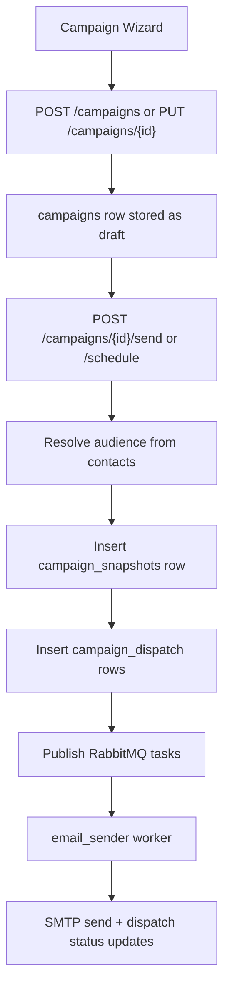
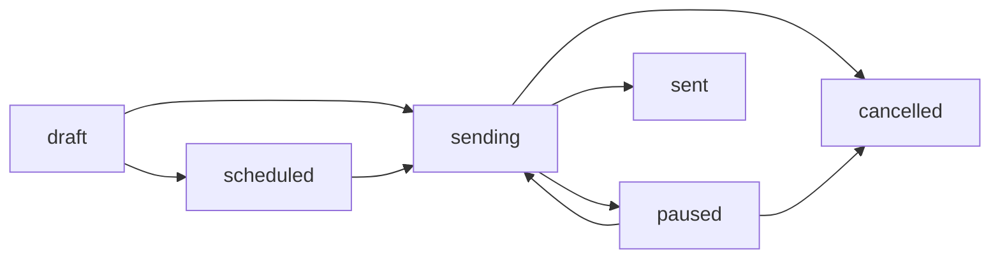

# Phase 4 - Campaign Orchestration

> Verification status: Verified against code
> Last reviewed: March 15, 2026
> Overall status: Core orchestration is implemented, but the phase is only mostly complete against the original checklist

## Purpose

Phase 4 establishes the campaign lifecycle layer of the platform. This is the phase where the product moves from static contacts and templates into actual send orchestration:

- create and edit campaigns
- choose an audience
- select or compose campaign content
- schedule or send immediately
- create per-recipient dispatch intents
- push delivery work into RabbitMQ
- manage active campaigns through pause, resume, and cancel actions

The campaign subsystem is real and functional in code today. The main issues are documentation drift, duplicated scheduler architecture, and a few frontend flows that do not fully match the backend contract.

## What Phase 4 Actually Builds

The current codebase implements Phase 4 as a wizard-plus-orchestration system:

1. A user creates or edits a campaign draft through the campaign wizard.
2. The backend stores the campaign in the `campaigns` table.
3. On send, the backend resolves the audience from contacts, batches, domains, or batch-domain combinations.
4. The backend snapshots the campaign body and subject.
5. The backend inserts `campaign_dispatch` rows as send intents.
6. The backend publishes RabbitMQ tasks for each recipient.
7. The worker sends emails and updates dispatch status.
8. Campaign state can be paused, resumed, cancelled, or scheduled.

This means Phase 4 is not built around an `email_tasks` table. The active runtime orchestration model is campaign record + dispatch rows + RabbitMQ tasks.

## Architecture

### Backend stack

- FastAPI routes in `platform/api/routes/campaigns.py`
- Supabase/PostgreSQL for campaign, snapshot, and dispatch persistence
- RabbitMQ for async delivery task publication
- Redis for fast live campaign-state checks by workers
- embedded scheduler in `platform/api/main.py`
- separate standalone scheduler script in `platform/worker/scheduler.py`
- worker execution in `platform/worker/email_sender.py`

### Frontend stack

- Next.js app router pages under `platform/client/src/app/campaigns`
- wizard flow in `platform/client/src/components/CampaignWizard`
- campaigns list page
- campaign detail page
- analytics page route exists separately

### Security and tenancy model

The current security model is application enforced:

- `require_active_tenant` provides tenant identity
- every campaign query filters by `tenant_id`
- send and schedule operations also verify tenant ownership before mutating records

This should not be described as DB-primary isolation through reliable RLS enforcement.

## Runtime Flow

## State Model

The active status values verified in code are:

- `draft`
- `scheduled`
- `sending`
- `sent`
- `paused`
- `cancelled`

There is also some frontend/UI handling for `processing`, but the main campaign table logic is built around the statuses above.

## What Is Implemented

### 1. Campaign CRUD

Verified routes:

- `POST /campaigns/`
- `GET /campaigns/`
- `GET /campaigns/{campaign_id}`
- `PATCH /campaigns/{campaign_id}`
- `PUT /campaigns/{campaign_id}`
- `DELETE /campaigns/{campaign_id}`
- `GET /campaigns/{campaign_id}/dispatch`

What is real:

- campaign creation works
- list and detail routes work
- update is supported through both `PATCH` and `PUT`
- delete behavior is conditional by status

### 2. Wizard-driven campaign creation

The campaign wizard is implemented and split into four steps:

- Step 1: Details
- Step 2: Audience
- Step 3: Content
- Step 4: Review

The wizard supports:

- step-by-step progression
- editing an existing draft
- saving a draft to the database
- browser-local draft persistence through `campaign_local_sessions`

### 3. Audience targeting

The current system supports more audience shapes than the old docs describe.

Verified patterns handled in backend send/schedule paths:

- `all`
- `batch:{id}`
- `domain:{domain}`
- `domains:{d1,d2}`
- `batch_domain:{batch_id}:{domain}`
- `batch_domains:{batch_id}:{d1,d2}`

This means Phase 4 now benefits from the domain-based audience work added in Phase 2.

### 4. Spintax and merge-tag processing

Verified backend helpers:

- `process_spintax()`
- `process_merge_tags()`

These are applied during send orchestration before RabbitMQ tasks are published.

### 5. Snapshot and dispatch intent creation

On send, the backend:

- inserts a `campaign_snapshots` row
- inserts `campaign_dispatch` rows
- publishes per-recipient work to RabbitMQ

This is the real orchestration behavior.

Important clarification:

- the active runtime code does not insert `email_tasks`
- any docs claiming that Phase 4 is built around `email_tasks` are outdated

### 6. Send-now and schedule-later flows

Verified routes:

- `POST /campaigns/{id}/send`
- `POST /campaigns/{id}/schedule`

Schedule flow:

- validates future datetime
- stores `scheduled_at`
- stores `audience_target`
- updates campaign to `scheduled`

Send-now flow:

- validates campaign state
- resolves audience
- enforces plan and daily limits
- snapshots campaign content
- creates dispatch rows
- queues RabbitMQ tasks

### 7. Pause, resume, and cancel

Verified routes:

- `POST /campaigns/{id}/pause`
- `POST /campaigns/{id}/resume`
- `POST /campaigns/{id}/cancel`

The current runtime design uses Redis as the worker-facing fast state store:

- `PAUSED`
- `SENDING`
- `CANCELLED`

and campaign table status as persistent UI state.

### 8. Test email route

The backend test route exists:

- `POST /campaigns/{id}/test`

It renders merge tags against a sample contact and sends directly via SMTP.

So backend test-send capability is real.

## What Is Partially Implemented

### Scheduler architecture

Scheduled sending exists, but the architecture is duplicated:

- embedded scheduler in `platform/api/main.py`
- standalone scheduler in `platform/worker/scheduler.py`

Both implement similar due-campaign polling and dispatch logic.

This means Phase 4 has scheduled sending, but not one clean single source of truth for scheduling.

### Draft persistence

Draft persistence exists in two forms:

- browser-local session storage
- explicit save-to-database action

This is usable, but not the same as continuous server-side autosave for every step.

### Campaign detail and analytics surfaces

Campaign list and detail pages are real, and there is an analytics route, but some metrics are still based on dispatch counts rather than the richer observability model expected from later phases.

## What Is Not Fully Working or Not Implemented

### Template picker mismatch in Step 3

`Step3Content.tsx` expects the templates API to return:

- `json.templates`

But the backend templates list route returns:

- `data`
- `total`
- `page`
- `limit`

This means the template-selection flow in the campaign wizard is not accurately wired to the current template API response shape.

### Test-email modal flow in Step 4

The frontend test-email handler creates a temporary draft campaign before calling `/test`.

But that temporary campaign creation omits required campaign fields such as:

- `from_name`
- `from_prefix`
- `domain_id`

The backend `CampaignCreate` model requires those fields.

So the backend route exists, but the current frontend modal flow is not fully reliable.

### Duplicate campaign flow on detail page

The campaign detail page tries to duplicate by creating a new campaign with only:

- name
- subject
- body_html
- status

This also omits required sender and domain fields, so the duplicate action is not fully wired to the current backend contract.

### Resend to unopened

This is not implemented in the current Phase 4 code and is still dependent on richer open-tracking data from later phases.

## Important Code Truths

### No separate `campaign_service.py`

The current campaign logic is not centered in a service module. Most orchestration logic lives directly in:

- `platform/api/routes/campaigns.py`

This matters because some older docs claim a cleaner service split than what actually exists.

### Hardcoded API base URLs remain in campaign frontend

Some campaign pages still use hardcoded values like:

- `http://127.0.0.1:8000`

while some wizard code uses `NEXT_PUBLIC_API_URL`.

This is a real configuration inconsistency.

### Duplicate route shapes exist

`campaigns.py` currently defines both:

- `PATCH /campaigns/{id}`
- `PUT /campaigns/{id}`

That is workable, but it increases surface area and can confuse frontend expectations if not documented clearly.

### Worker state and DB state are intentionally split

Redis is used so workers can respond immediately to live campaign actions. The DB stores the persistent campaign status shown in the UI.

That is a valid design, but docs should state it explicitly instead of implying only one state source.

## Completion Matrix

| Area | Status | Notes |
|---|---|---|
| Campaign CRUD | Implemented | Create, list, detail, update, delete all exist |
| Campaign wizard | Implemented | Four-step wizard is real |
| Audience targeting | Implemented | Includes all, batch, domain, and batch-domain variants |
| Spintax + merge tags | Implemented | Applied during send orchestration |
| Snapshot creation | Implemented | `campaign_snapshots` rows are created |
| Dispatch intent creation | Implemented | `campaign_dispatch` rows are inserted |
| RabbitMQ orchestration | Implemented | Real publish flow exists |
| Scheduled sending | Implemented with drift | Works, but scheduler logic exists in two places |
| Pause / resume / cancel | Implemented | Redis + DB status flow exists |
| Campaign list page | Implemented | Search, pagination, status badges exist |
| Campaign detail page | Implemented | Metrics, dispatch info, actions exist |
| Template picker in wizard | Partial / mismatched | Frontend expects wrong templates payload shape |
| Test email modal UX | Partial / mismatched | Backend route exists, frontend temp-draft flow is incomplete |
| Duplicate campaign action | Partial / mismatched | Frontend omits required create fields |
| Resend to unopened | Not implemented | Depends on richer observability |

## Recommendations

1. Consolidate scheduling into one canonical implementation, either embedded or standalone, not both.
2. Move campaign orchestration logic out of `routes/campaigns.py` into a dedicated service layer before Phase 4 grows further.
3. Fix the Step 3 template picker to consume the actual templates API payload shape.
4. Fix test-email and duplicate flows so they include required sender/domain fields or reuse an existing campaign id directly.
5. Normalize campaign frontend API base URLs to `NEXT_PUBLIC_API_URL`.
6. Decide whether `PATCH` and `PUT` are both needed, then standardize on one clear update contract.

## Bottom Line

Phase 4 is real and already useful. The platform can create campaigns, orchestrate recipients, queue work, schedule future sends, and manage live campaign state.

But the old docs were too optimistic. The correct status is:

- campaign orchestration core: implemented
- wizard and operator controls: implemented
- operational completeness against the original Phase 4 promise: mostly complete, with a few important frontend-backend mismatches still open

---
## Technical Appendix (Engineering view)
- Tables: campaigns, campaign_dispatch, email_tasks (queue); fields status, scheduled_at, locked_by.
- Endpoints: /campaigns CRUD, /campaigns/{id}/pause|resume|cancel, scheduler loop; audience selection via batches/domains.
- Worker: RabbitMQ consumer builds emails, respects pause/cancel, dispatch state machine.
- UI: campaign wizard under platform/client/src/app/campaigns/*; audience domain filtering and batch selection implemented.
