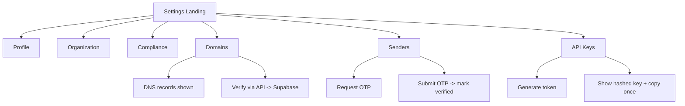

# Phase 8 — Account Settings & Administration

> **Status:** ⚠ Partially Complete (Team Management + Webhooks config pending)
> **Last Reviewed:** March 15, 2026

## Objectives
- Centralize tenant settings (profile, org, compliance, developer tools) behind RLS-safe APIs.
- Keep deliverability + compliance guardrails visible (domain & sender verification, GDPR tools).
- Leave clean seams for Phase 11 (Team Management, Webhooks config).

## Current Footprint (shipping today)
**8A — Settings Core**
- Settings landing page (`/settings`) with nav cards.
- Profile (`/settings/profile`) — name, timezone; PATCH → `/api/profile`.
- Organization (`/settings/org`) — CAN-SPAM physical address; PATCH → `/api/org`.

**8B — Security & Compliance**
- Right-to-erase (contact anonymize) — POST `/compliance/erase/{contact_id}` → nulls PII, marks anonymized.
- Data export — POST `/compliance/export` enqueues CSV job; GET `/compliance/export/{job_id}` streams file.
- Compliance checklist page (`/settings/compliance`).

**8C — Developer Tools & Deliverability**
- API keys CRUD — POST `/api-keys` (returns token once, stores SHA-256 hash), GET lists metadata, DELETE revokes.
- Domains — POST `/domains` create, GET list/status, POST `/domains/{id}/verify` triggers DNS check; UI shows SPF/DKIM/DMARC records.
- Senders — POST `/senders/verify-request` (issue OTP), POST `/senders/verify-submit` (confirm OTP), GET `/senders` list; campaigns blocked from unverified senders via RLS/policy.
- DNS & sender status surfaced in settings UI.

## Still Outstanding (to be completed in Phase 11)
- Team Management UI + invites + roles.
- Webhooks configuration page (URL + event subscriptions) with signing secret.

## Architecture (at-a-glance)
- **Frontend:** Next.js app routes under `/settings/*`; server actions call FastAPI. All forms show optimistic loading + toast.
- **Auth/RLS:** Supabase JWT → `tenant_id` claim. Every write uses `eq("tenant_id", tenant_id)` plus PostgREST RLS policies: `tenant_id = auth.jwt().tenant_id` and `deleted_at is null`.
- **Backend modules:**
  - `routes/profile.py` — GET/POST profile & org; validates timezone/addr.
  - `routes/compliance.py` — export + erase; exports stream from storage; erase nulls PII columns and sets `anonymized_at`.
  - `routes/domains.py` — CRUD + verify; stores DNS targets and `verified_at`.
  - `routes/senders.py` — OTP issuance via SES/SMTP; stores `otp_hash`, `otp_expires_at`, `is_verified`.
  - `routes/api_keys.py` — SHA-256 hash at rest; token shown once in response.
- **Data model highlights:**
  - `tenants(id, name, address, timezone, plan_id, daily_send_limit, daily_sent_count)`
  - `domains(id, tenant_id, domain_name, status, dkim_selector, txt_record, cname_record, verified_at)`
  - `verified_senders(id, tenant_id, email, otp_hash, otp_expires_at, is_verified, created_at)`
  - `api_keys(id, tenant_id, name, hash, last_used_at, created_at, deleted_at)`
  - `audit_logs(id, tenant_id, actor_id, action, entity, entity_id, created_at)` (recommended; partial coverage).

## Flow (happy paths)

## Acceptance Checklist
- [x] Settings landing page renders cards for all subsections.
- [x] Profile/Organization forms validate and persist via API with tenant scoping.
- [x] Data export and right-to-erase flows respond with job/file; PII is nulled on erase.
- [x] Compliance checklist visible and tenant-scoped.
- [x] Domain verification UI shows SPF/DKIM/DMARC + verifies status.
- [x] Sender verification flow (OTP) blocks unverified senders from campaigns.
- [x] API key creation shows token once, stores SHA-256 hash only; list returns metadata only.
- [ ] Team Management (invite/roles) implemented and gated by RLS.
- [ ] Webhooks configuration page (URL + event selection) with signature secret.

## Risks / Next Steps
- Add audit logging around key actions (new API key, domain deleted, export run).
- Rate-limit sensitive endpoints (API key creation, sender verification requests).
- Prepare RBAC for Team Management (Phase 11): roles table + policy checks.
- Expose webhook signing secret alongside URL config when Phase 11 ships.

---
## Technical Appendix (Engineering view)
- Endpoints: profile/org (`/profile`, `/org`), compliance (`/compliance/export`, `/compliance/erase/{contact_id}`), domains (`/domains`, `/domains/{id}/verify`), senders (`/senders/verify-request`, `/senders/verify-submit`, `/senders`), api keys (`/api-keys`).
- Data: tenants (timezone/address/plan), domains (dkim/spf/dmarc, verified_at), verified_senders (otp_hash, otp_expires_at, is_verified), api_keys (sha256 hash, last_used_at).
- RLS: tenant_id scoping on all settings tables.
- UI: /settings landing; profile/org; compliance page; domains & senders setup; api keys page.
- Pending: team management + webhook config (to be added later).
