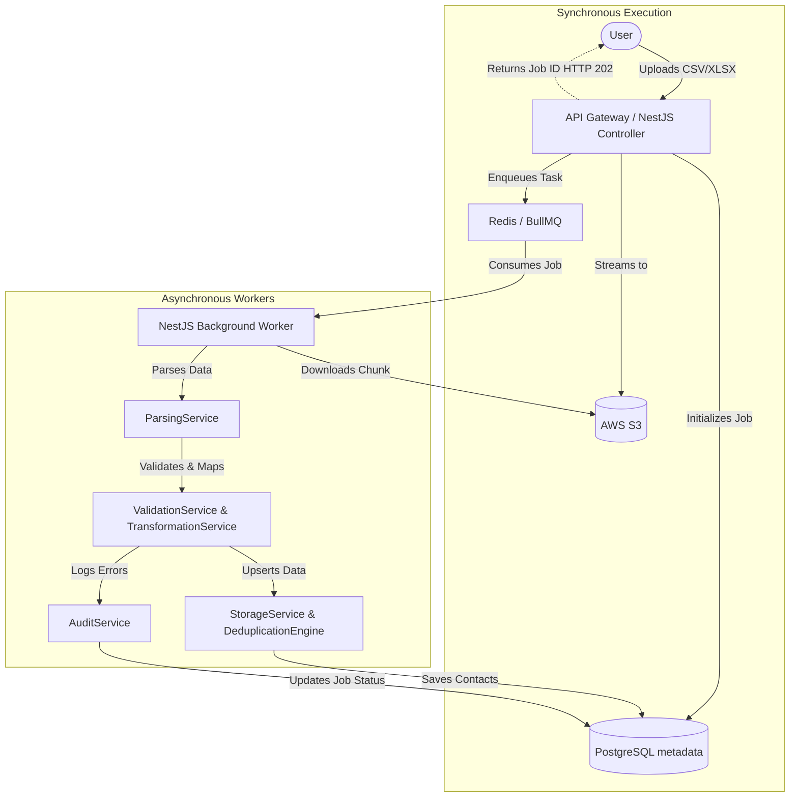
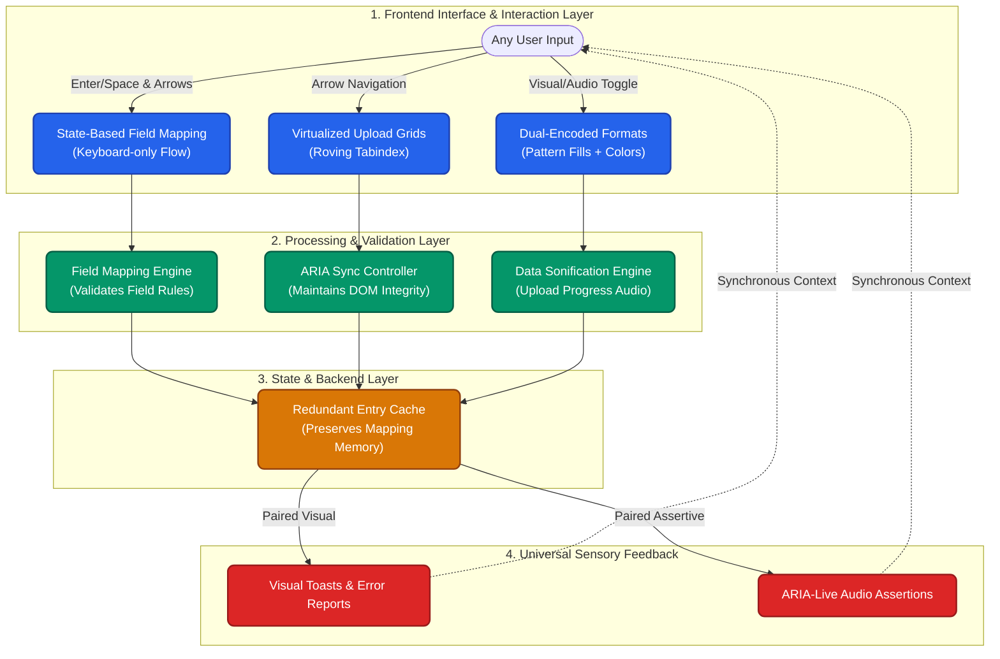

# Project 1: Data Uploading & Field Management Architecture

## 1. Purpose
The Data Ingestion System acts as the primary gateway for importing contact lists, subscriber data, and custom attributes into the multi-tenant email marketing platform. In a scalable context similar to Mailchimp or SendGrid, the ability to reliably, securely, and rapidly ingest millions of records is critical for user onboarding and campaign execution. This system ensures that all uploaded data is validated, sanitized, mapped to dynamic schemas, and safely stored with strict tenant isolation before it is made available to the campaign dispatch engines.

## 2. Core Features
- **CSV/XLSX Upload Support:** Secure, high-throughput endpoints for handling large file uploads in standard tabular formats.
- **Dynamic Custom Fields:** Support for arbitrary numbers of user-defined attributes (e.g., "Birthday", "Last Purchase Date") alongside standard fields (Email, First Name, Last Name).
- **Robust Validation System:** Row-by-row syntax, data type, and business rule validation, ensuring system-wide data integrity.
- **Multi-tenant Data Isolation:** Strict logical separation of data across different active tenants to prevent cross-contamination or data leakage.
- **Comprehensive Error Reporting:** Generation of actionable error reports indicating exactly which rows failed and why, supporting partial success of bulk data uploads.

## 3. Architecture Design
The ingestion system utilizes a microservices-inspired modular architecture within NestJS.

- **`DataIngestionModule`:** The main entry point and orchestrator module that wires up the controllers and underlying services for the ingestion domain.
- **`UploadService`:** Manages the temporary storage and streaming of incoming files directly to AWS S3, returning secure file identifiers for asynchronous processing to prevent API blocking.
- **`ParsingService`:** Responsible for streaming data from S3, identifying the file format (CSV/XLSX), and converting the file chunks into processable intermediate JSON objects without exceeding memory limits.
- **`ValidationService`:** Applies predefined validation rules (e.g., Regex for emails, boolean checks) and custom tenant schema rules to each parsed row.
- **`FieldManagementService`:** Handles the CRUD operations for dynamic custom fields per tenant, ensuring the data mapping phase correctly interprets incoming dynamic columns.
- **`TransformationService`:** Normalizes data (e.g., lowercasing emails, formatting dates to ISO 8601) and maps raw file column names to the tenant's expected schema fields.
- **`DeduplicationEngine`:** Checks for existing contacts within the tenant's isolated data pool, determining whether a row constitutes an `INSERT` or an `UPDATE` (Upsert logic).
- **`StorageService`:** Abstracts the database persistence layer, managing high-throughput batched bulk operations to PostgreSQL.
- **`QueueService`:** Interfaces with Redis and BullMQ to distribute parsing, validation, and storage tasks across multiple background workers, smoothing out traffic spikes during massive file uploads.
- **`AuditService`:** Records the start, progress, completion, and any systemic errors of the upload job for system observability and user-facing status updates.

## 4. Mermaid Flow Diagram

## 5. Execution Flow
1. **Initiation:** The marketer initiates an upload via the client dashboard. The frontend streams the file to the NestJS `/ingest/upload` endpoint.
2. **Secure Storage:** The `UploadService` streams the multi-part file directly to AWS S3, bypassing Node.js heap limitations.
3. **Job Creation:** An overarching "Import Task" record is created in PostgreSQL with a `Pending` status.
4. **Queueing:** The API returns a `job_id` (HTTP 202 Accepted) to the client and enqueues a `ProcessFile` job in BullMQ (backed by Redis).
5. **Processing (Async):** A background worker picks up the job. The `ParsingService` establishes a read stream from S3 and begins reading the file in chunks.
6. **Data Pipeline:** For each chunk (e.g., 1000 rows):
   - `FieldManagementService` provides the tenant's required custom schema.
   - `ValidationService` ensures data cleanliness. Invalid rows are bypassed and logged.
   - `TransformationService` sanitizes values for uniformity.
   - `DeduplicationEngine` prepares upsert operations based on primary identifiers (e.g., Email).
7. **Persistence:** `StorageService` performs batched bulk inserts/updates to PostgreSQL.
8. **Finalization:** Once the End-of-File (EOF) is reached, `AuditService` calculates total successful rows, logs aggregated errors, and marks the job as `Completed`.

## 6. Data Modeling Strategy
To intelligently support multi-tenancy alongside highly dynamic schemas (custom fields), we employ a hybrid structure:

- **Entity-Attribute-Value (EAV) vs. JSONB:** Leveraging PostgreSQL's advanced JSON capabilities, a `JSONB` column is utilized for custom fields. This balances query performance, indexing capability, and schema flexibility far better than traditional EAV structures.
- **Multi-tenant Design:** Every authoritative table includes a strictly enforced `tenant_id` column.
- **Indexing Strategy:** 
  - Compound standard B-Tree indexes on `(tenant_id, email)` for lightning-fast deduplication and lookups.
  - GIN (Generalized Inverted Index) on the `JSONB` properties column to allow fast, sophisticated segmentation queries (e.g., "Find all users where VIP status is true").

## 7. Scalability & Performance
- **Streaming Uploads:** Node.js streams pipe uploaded data directly to S3 without buffering the whole file in memory, keeping memory footprints flat regardless of file size.
- **Queue-Based Processing:** BullMQ effectively throttles asynchronous processing, ensuring the primary database cluster isn't overwhelmed by concurrent users uploading millions of records simultaneously.
- **Bulk Inserts:** Rather than single `INSERT` statements, data is batched into groups of 1,000-5,000 rows utilizing optimized PostgreSQL `COPY` commands or multi-row `INSERT ... ON CONFLICT` clauses.
- **Retry Mechanisms:** Transient failures in the worker layer (e.g., DB lock contention, network blips) trigger an automatic retry via BullMQ's exponential backoff settings, guaranteeing at-least-once processing.

## 8. Security & RBAC
- **Role-Based Access Control (RBAC):** NestJS Guards ensure that only authenticated users possessing the `Admin` or `Marketer` roles can execute data uploads. `Viewer` roles are restricted to read-only API access.
- **PostgreSQL Row-Level Security (RLS):** Data isolation is enforced at the database layer. RLS policies force the engine to append `WHERE tenant_id = current_setting('app.current_tenant')` to all operations. This guarantees zero cross-tenant data bleed, natively preventing unauthorized access even in the event of an application-layer logic flaw.
- **S3 Security:** Uploaded files in S3 are inaccessible to the public internet. Pre-signed URLs with short TTL expirations are generated only for authorized internal background workers.

## 9. Error Handling & Observability
- **Row-Level Validation Errors:** The ingestion framework embraces partial failures. If row 4,055 contains an invalid email address format, the system discards the row, logs an entry in an `import_errors` table detailing the specific column and failure reason, and continues processing the rest of the file uninterrupted.
- **Logging & Monitoring:** 
  - Winston is deployed for structured, centralized JSON logging.
  - BullMQ Native Dashboards provide real-time tracking of queue depth, worker saturation, and delayed/failed jobs.
  - Integration with APM tools guarantees observability of specific unhandled exceptions, specifically around memory limits or connection pool exhaustion.

## 10. Future Improvements
- **Real-time Upload Progress:** Integrate WebSockets (e.g., Socket.io) to push granular execution percentage updates from the background workers to the frontend dashboard.
- **AI-Based Data Cleaning:** Introduce an LLM-assisted or heuristic pre-processing step to intelligently catch typos (e.g., `user@gmial.com` -> `user@gmail.com`) or normalize physical mailing addresses.
- **Smart Field Mapping:** Automatically detect and logically map column headers against existing database schemas (e.g., confidently routing the CSV column `First Name` to the database field `first_name`) during the initial upload phase via fuzzy string matching algorithms.

---

## 11. Platform-Wide: Universal Accessibility Architecture

*Note: Following deep discussions on ensuring our platform is delivered to every type of person without compromise, we engineered an entirely new architectural flow. This is not a secondary feature—this is the foundational flow of how our platform handles interactions, memory, and sensory feedback natively.*

To ensure our platform scales smoothly to users operating in any environment—whether that involves high-contrast mode, assistive auditory tools, or keyboard-only navigation—we have structurally integrated **Universal Access Flows** directly into the core engineering layer of the Data Uploading System. We do not rely on standard DOM overlays; instead, we re-engineered the state mechanics.

### The Inclusive Engineering Diagram

### The Engineering Flows
1. **The 'No-Mouse' Operation Flow**: During the critical data-mapping phase, instead of forcing users to drag-and-drop CSV headers to database fields (which is physically impossible for many), our builder uses a dedicated **State-Based Reordering Model**. You press `Enter` to "grab" a CSV column, use arrows to move through target database fields, and hit `Enter` again to "drop" and connect them.
2. **The High-Scale Virtualization Flow**: You cannot render a preview of 2 Million uploaded contacts on screen without exhausting DOM memory or crashing a screen reader. We use a **`Roving Tabindex`** paired with programmatic `aria-rowcount`/`aria-rowindex` syncing. The data preview UI only loads 20 rows visually, but the programmatic tree seamlessly informs the computer you are navigating "Row 145,000 of 2,000,000" inside the massive CSV.
3. **The Data Sonification & Dual-Encoding Flow**: Data ingestion stats (like invalid rows vs successful rows) are notoriously visual-dependent. We eliminate this bottleneck by introducing **Data Sonification** (mapping the rapid speed of the data upload progress to dynamic audio frequencies) and **Dual-Encoding** (ensuring error graphs and analytics map to unique SVG texture patterns or direct numeric annotations, not just red/green colors).
4. **The Cognitive Memory Flow**: Uploading a large list with 50 custom fields is computationally and structurally exhausting. We implement strict **Redundant Entry Prevention** caching. What a user maps in their first upload auto-populates all future list uploads. If background parsing takes 15 minutes, timeouts are never silent—they throw an assertive 2-minute visual and screen-reader warning so users never randomly lose focused work.
5. **The Paired Sensory Feedback Flow**: No system event (e.g., encountering a malformed email structure during the validation step) relies solely on a "beep" or solely on a red highlight. Every single validation failure or state shift immediately emits both a visual toast banner *and* an `aria-live` assertive announcement simultaneously, guaranteeing universal state awareness.
