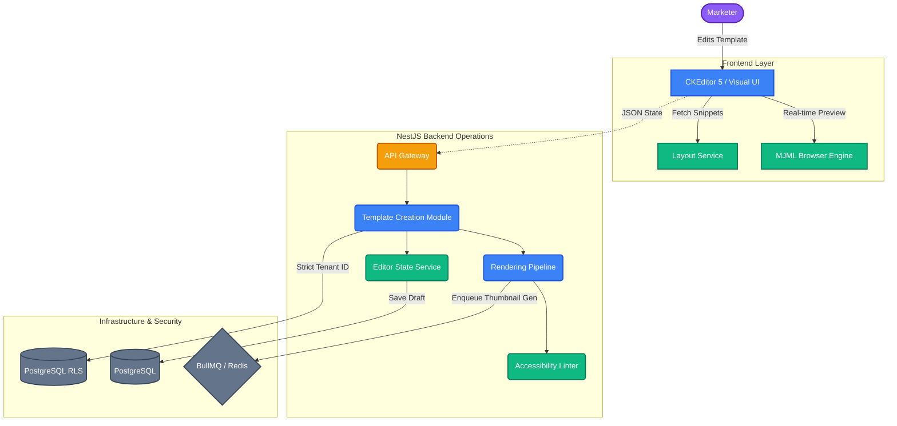

# Project 2: Email Creation & Template Management Architecture

## 1. Purpose
The Email Creation System is the foundational content engine of the platform. Its primary role is to provide a user-friendly, visual interface for designing high-quality, responsive emails while ensuring that the resulting output is strictly compliant with email client standards and accessibility mandates. This system bridges the gap between the marketer's creative intent and the technical reality of email-safe HTML.

## 2. Core Features
- **Section-Based Visual Editor**: A structured editing environment using CKEditor 5 that prevents layout breakage by focusing on predefined MJML-backed sections.
- **Dynamic Template Library**: A multi-tenant repository for storing, cloning, and reusing email designs.
- **MJML-First Rendering**: Native integration with the MJML engine to guarantee cross-client responsiveness (Outlook, Gmail, Apple Mail).
- **Personalization Token Engine**: Robust support for injecting dynamic variables like `{{first_name}}` and `{{unsubscribe_link}}` directly into the content.
- **Accessibility Safeguards**: Real-time linting for image alt-texts, heading hierarchies, and contrast ratios (WCAG 2.2 AA).

## 3. Architecture Design
The creation system is modularized within NestJS, ensuring high performance and strict data isolation.

- **`TemplateCreationModule`**: The central orchestrator for the creation domain.
- **`LayoutService`**: Manages the library of "Snippets" (MJML blocks). It ensures that users can only drag-and-drop structural components that are pre-validated as "email-safe."
- **`EditorStateService`**: Synchronizes the real-time state of the visual editor with the backend, handling auto-saves and version drafts.
- **`RenderingPipeline`**: A high-throughput service that converts the visual editor's structured JSON or MJML into standardized, minified HTML.
- **`AssetManager`**: Handles image uploads and optimization, ensuring that all media is hosted securely with appropriate CDNs (e.g., AWS S3).
- **`TokenService`**: Validates that all personalization tokens injected by the user are available in the tenant's global schema (linking back to Project 1's field management).
- **`AccessibilityLinter`**: Scans the MJML AST (Abstract Syntax Tree) during the save process to flag missing `alt` tags or semantic errors.

## 4. Mermaid Flow Diagram



## 5. Execution Flow
1. **Selection**: The user selects a base template or a blank MJML canvas from the `Gallery`.
2. **Editing**: As the user drags a "Snippet" (e.g., a Hero Section), the `LayoutService` provides the exact MJML logic to the CKEditor instance.
3. **Validation**: The `TokenService` cross-checks any manually typed `{{tokens}}` against the tenant's data fields.
4. **Rendering (Async)**: When the user hits "Save," the `RenderingPipeline` enqueues a job in BullMQ to:
   - Generate a high-fidelity HTML version.
   - Run the `AccessibilityLinter`.
   - Take a screenshot (thumbnail) of the template for the library view.
5. **Storage**: The finalized template is persisted in PostgreSQL with a `tenant_id` stamp.

## 6. Multi-Tenant Data Modeling
We utilize a highly secure PostgreSQL structure consistent with the platform's overarching security goals:

- **Entity**: `Template`
- **Fields**: `id`, `name`, `content_mjml`, `content_json`, `thumbnail_url`, `tenant_id`.
- **Security Policy**: 
  ```sql
  CREATE POLICY tenant_isolation_policy ON templates
  USING (tenant_id = current_setting('app.current_tenant')::UUID);
  ```
- **Why it matters**: This ensures that even a malicious actor cannot access another company's email designs by guessing IDs.

## 7. Performance & Scalability
- **Virtual Snippet Rendering**: To keep the editor fast, we use a virtualized preview that only renders the updated section instead of the entire email on every keystroke.
- **BullMQ Orchestration**: We offload the heavy lifting of `MJML -> HTML` transpilation to background workers, ensuring the API response time for "Save" is under 200ms.
- **CDN Caching**: Finalized email assets and images are cached at the edge to ensure high delivery speeds during campaign dispatch.

## 8. Accessibility Commitment (WCAG 2.2 AA)
Project 2 follows the **Universal Access Flows** found in Project 3:
- **Semantic Integrity**: Our `AccessibilityLinter` rejects any "Save" action if an image is missing an `alt` attribute or if the heading logic is skipped (e.g., jumping from H1 to H3).
- **Keyboard Navigation**: The editor is fully navigable via arrows and spacebar, utilizing the "Roving Tabindex" pattern for snippet movement.

## 9. Security & RBAC
- **Roles**:
  - `Designer`: Can create, edit, and delete templates.
  - `Approver`: Can view and approve templates for campaigns.
  - `Viewer`: Read-only access to the template gallery.
- **OIDC Integration**: The user's role and `tenant_id` are extracted from the Auth0/Okta JWT and injected into the backend request context.
