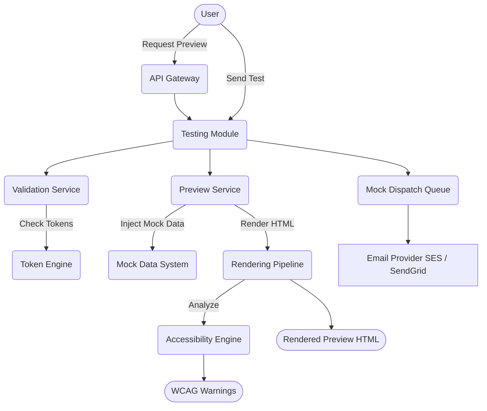

# Project 3: Email Testing System Architecture

## 1. Purpose
The Email Testing System serves as the final validation gateway before any campaign is sent. Its primary function is to eliminate rendering inconsistencies and personalization errors across various email clients and devices, ensuring a flawless recipient experience.

## 2. Core Features
- **Multi-Device & Multi-Client Preview**: Simulates rendering across desktop, mobile, and popular email clients.
- **Test Email Dispatch**: Ability to send test emails to internal stakeholders or predefined testing addresses.
- **Personalization Validation**: Checks token integrity, default fallbacks, and data injection safety.
- **Accessibility Checks (WCAG Hints)**: Built-in validation to ensure emails are readable by assistive technologies.

## 3. Architecture Design
The testing system is built as a highly cohesive set of NestJS modules and services designed for rapid execution and stateless validation.

### Sub-Modules Breakdown
- **`TestingModule`**: The entry point for all testing flows.
- **`PreviewService`**: Handles HTML processing and viewport simulations.
- **`ValidationService`**: Responsible for parsing tokens and verifying injectability.
- **`MockDataService`**: Manages and injects mock payloads into templates for previewing.
- **`AccessibilityEngine`**: Scans rendered HTML to suggest WCAG improvements.

### Mermaid Flow Diagram

## 4. Execution Flow
1. **Initiation**: The user requests a preview via the frontend client.
2. **Token Checks**: The `ValidationService` extracts variables like `{{name}}` and maps them against default tenant fallback data or a user-provided mock payload.
3. **Pipeline Processing**: 
   - The raw template and payload are passed to the **Rendering Pipeline**.
   - HTML is compiled.
   - The **Accessibility Engine** runs a lightweight linter on the rendered code.
4. **Delivery**:
   - The frontend receives the rendered HTML, validation errors, and WCAG hints.
   - If requested, the **Preview Service** can forward the rendered artifact to an external ESP (e.g., AWS SES) as a single test email.

## 5. Architectural Improvements (Beyond Legacy Systems)
- **Real-time Preview Updates**: Websocket-driven or fast stateless API endpoints that allow live updating as the user edits the template.
- **Email HTML Linting**: Embedded structural linting (e.g., checking for unclosed tags, CSS inline requirements).
- **Accessibility Validation Engine**: Dedicated component for evaluating contrast ratios and alt-text presence.
- **Deep Error Reporting**: Context-aware error mapping that highlights the exact line of templating failure instead of generic backend exceptions.

## 6. Multi-Tenant & RBAC Strategy
- **Tenant Isolation**: Every API endpoint within the `TestingModule` strictly binds to `tenant_id`. Templates and user mock data are strongly isolated via Row-Level Security in PostgreSQL.
- **RBAC Roles**: 
  - *Admins/Marketers*: Allowed to initiate rendering, save mock payloads, and dispatch test emails.
  - *Viewers*: Can only request previews; sending test emails is explicitly blocked.
