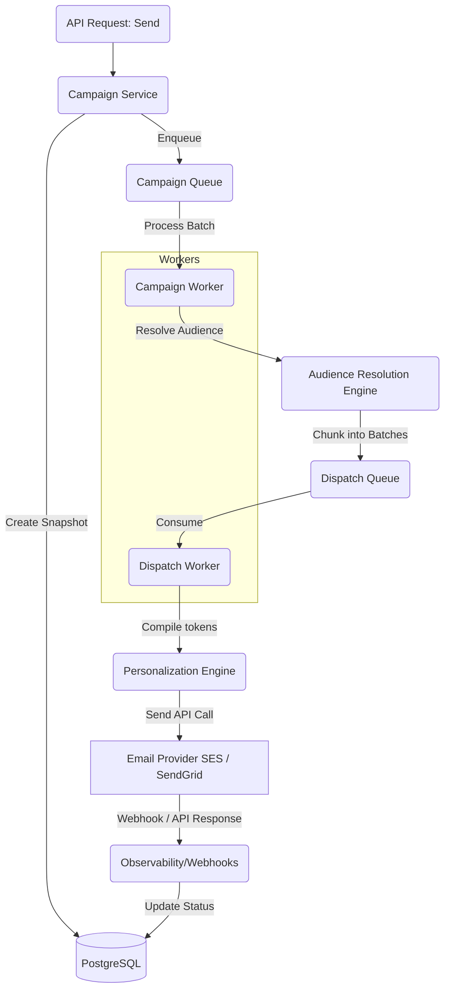

# Project 4: Email Sending & Scheduling System

## 1. Purpose
The Email Sending & Scheduling system is the robust, high-throughput engine of the platform. It is engineered to reliably execute marketing campaigns at scale, seamlessly handling immediate dispatches ("send now") and complex delayed scheduling while guaranteeing zero message loss.

## 2. Core Features
- **Campaign Execution**: Instant and bulk dispatching of emails.
- **Advanced Scheduling**: Deferred execution logic supporting cron and delayed BullMQ jobs.
- **Audience Resolution**: Dynamic segmentation, list collapsing, and contact evaluation just-in-time.
- **Personalization Engine**: Fast token replacement at scale on a per-recipient basis.
- **Real-time Status Tracking**: Tracking dispatch progress, bounces, and engagements.

## 3. Architecture Design
This subsystem relies heavily on message brokers for asynchronous throughput and fault tolerance.

### Components
- **`CampaignModule`**: Orchestrates creation, state transitions (Draft -> Active -> Sent).
- **`DispatchService`**: Bridges campaigns with queue architecture.
- **`QueueService`**: Interfaces natively with BullMQ (Redis).
- **`SchedulerService`**: Manages future executions.

### Queue Topology (BullMQ)
- **Campaign Queue**: Handles high-level "Start Campaign X" jobs. Responsible for resolving the audience and batching messages.
- **Dispatch Queue**: Fine-grained queue handling the actual "Send to Contact Y" jobs, rate-limited and concurrent.

### Data Model
- `tenants` (Core isolation root)
- `sender_identities` (Verified domains/emails per tenant)
- `campaigns` (Metadata, schedule times, targeting params)
- `campaign_snapshots` (Immutable capture of the template/settings at the exact moment of send)
- `dispatch_jobs` (Stateful tracking: pending, sent, failed)
- `contacts` (Recipient data with JSONB for custom attributes)

## 4. Execution Flow

## 5. Scheduling Flow
1. User sets a campaign to "Scheduled" with a UTC `scheduled_at` timestamp.
2. The `SchedulerService` creates a delayed job in BullMQ rather than an active one.
3. At the correct time, Redis promotes the job to the `Campaign Queue`.
4. The system seamlessly proceeds with the standard `Execution Flow` as if it were a "send now" request.

## 6. Personalization at Scale
- **Token Engine**: Evaluates `{{name}}` or nested `{{custom_fields.tier}}` against the contact record directly within the `Dispatch Worker`.
- **Per-Recipient Rendering**: Final HTML is rendered just before dispatch to ensure dynamic data (e.g., location, time limits) is maximally accurate at the time of send.

## 7. Scalability & Resilience
- **Batch Processing**: Database reads and queue writes are batched (e.g., 5,000 items per chunk) to avoid memory spikes and optimize I/O.
- **Tenant Rate Limiting**: BullMQ rate-limiting logic ensures a noisy neighbor tenant does not consume the entire worker pool.
- **Retry Strategy**: Built-in exponential backoff for transient ESP failures.
- **Dead-Letter Queues (DLQ)**: Hard-failing jobs are shunted to a DLQ for manual inspection or bulk replay instead of looping infinitely.

## 8. Deliverability & Compliance
- **Domain Verification**: Enforces that the `sender_identity` associated with a campaign has passed internal checks for DNS records (SPF, DKIM, DMARC) before the campaign can transition from `Draft`.
- **Pre-flight Checks**: Drops or quarantines emails with missing required headers (e.g., `List-Unsubscribe`).

## 9. Next-Gen Improvements (Beyond Legacy Systems)
- **Idempotency Rules**: Redis locks and robust job ID generation mapped to contact IDs ensure emails are strictly sent "at most once".
- **Provider Failover**: Circuit breaker patterns detecting consecutive SES failures can dynamically route traffic to a secondary ESP (e.g., SendGrid).
- **Bounce-Rate Circuit Breaker**: If the dispatch queue detects an anomalous spike in bounces for a campaign, it pauses execution and alerts the tenant.
- **Extensive Observability**: Structured JSON logging and Prometheus metrics exported from BullMQ for real-time dashboarding.

## 10. Multi-Tenant & RBAC Strategy
- **Row-Level Security (RLS)**: PostgreSQL policies dictate that no worker can accidentally read or process cross-tenant data. 
- **Roles**:
  - *Admins*: Full configuration, scheduling, and failover control.
  - *Marketers*: Can schedule and execute but cannot alter sender identities.
  - *Viewers*: Read-only access to campaign progress tracking and metrics.
