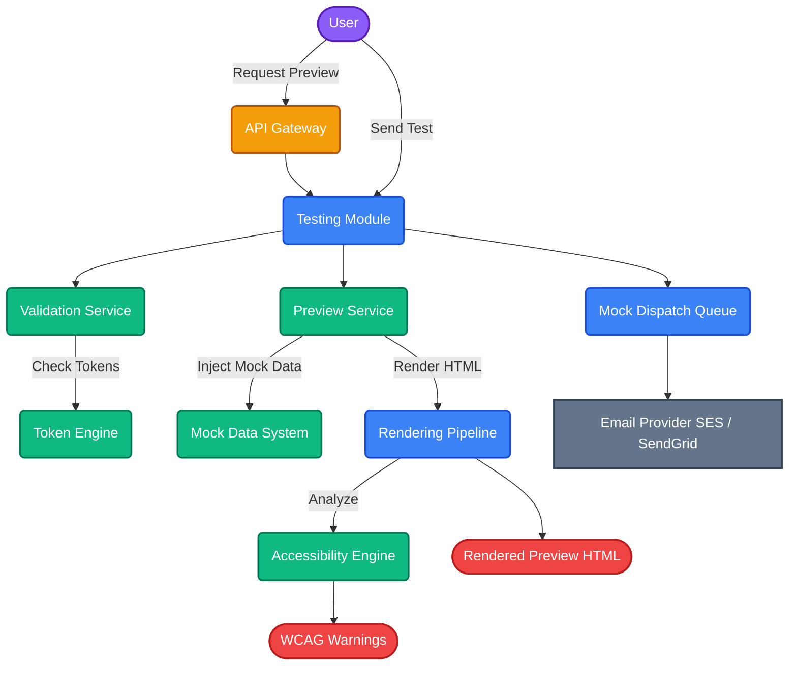
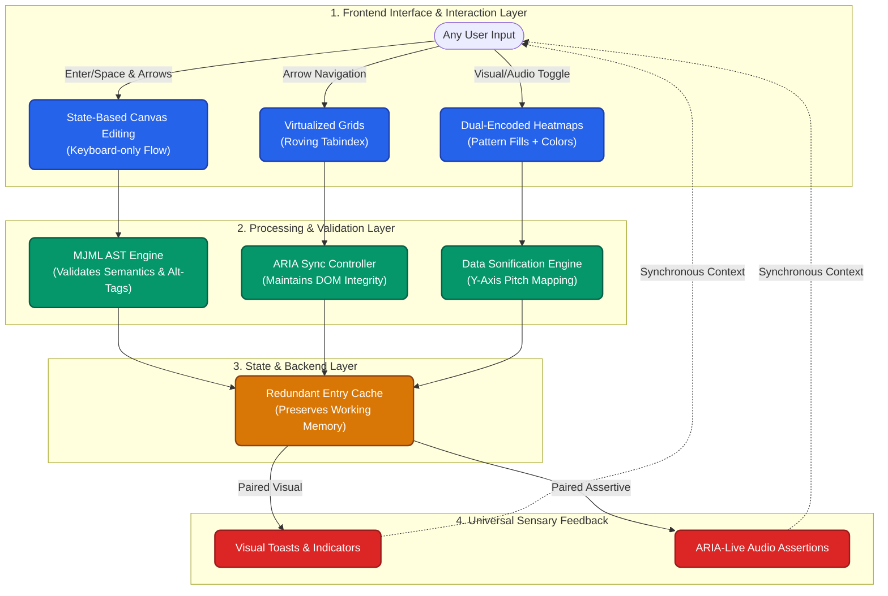

# Project 3: Email Testing System Architecture

## 1. Purpose
The Email Testing System serves as the final validation gateway before any campaign is sent. Its primary function is to eliminate rendering inconsistencies and personalization errors across various email clients and devices, ensuring a flawless recipient experience.

## 2. Core Features
- **Multi-Device & Multi-Client Preview**: Simulates rendering across desktop, mobile, and popular email clients.
- **Test Email Dispatch**: Ability to send test emails to internal stakeholders or predefined testing addresses.
- **Personalization Validation**: Checks token integrity, default fallbacks, and data injection safety.
- **Deep Accessibility Enforcement (WCAG 2.2 AA)**: Scans rendered HTML to suggest WCAG improvements and strictly enforces accessibility mandates on the generated output (e.g., semantic headings, alt texts).

## 3. Architecture Design
The testing system is built as a highly cohesive set of NestJS modules and services designed for rapid execution and stateless validation.

### Sub-Modules Breakdown
- **`TestingModule`**: The entry point for all testing flows.
- **`PreviewService`**: Handles HTML processing and viewport simulations.
- **`ValidationService`**: Responsible for parsing tokens and verifying injectability.
- **`MockDataService`**: Manages and injects mock payloads into templates for previewing.
- **`AccessibilityEngine`**: A rigorous validation layer that inspects the MJML Abstract Syntax Tree (AST) before transpilation. It enforces `alt` attributes on images, validates semantic heading hierarchies (e.g., H1 -> H2 -> H3), and automatically injects `lang` and `dir` parameters based on the user's profile to support screen reader pronunciation engines.

### Mermaid Flow Diagram

## 4. Execution Flow
1. **Initiation**: The user requests a preview via the frontend client.
2. **Token Checks**: The `ValidationService` extracts variables like `{{name}}` and maps them against default fallback data or a user-provided mock payload.
3. **Pipeline Processing**: 
   - The raw template and payload are passed to the **Rendering Pipeline**.
   - HTML is compiled.
   - The **Accessibility Engine** runs a lightweight linter on the rendered code.
4. **Delivery**:
   - The frontend receives the rendered HTML, validation errors, and WCAG hints.
   - If requested, the **Preview Service** can forward the rendered artifact to an external ESP (e.g., AWS SES) as a single test email.

## 5. Architectural Improvements
- **Real-time Preview Updates**: Websocket-driven or fast stateless API endpoints that allow live updating as the user edits the template.
- **Email HTML Linting & AST Validation**: Embedded structural linting (e.g., checking for unclosed tags, CSS inline requirements). Templates failing critical accessibility checks (like missing image alt tags) are outright rejected.
- **Automated Accessibility Testing in CI/CD**: Integration of `@axe-core/playwright` into the automated testing lifecycle. Every pull request simulates zero-configuration workflows (e.g., testing the wizard) and mercilessly fails builds if WCAG 2.2 AA violations are detected (WCAG 2.2 SC 2.4.11, 2.4.13, etc.).
- **Deep Error Reporting**: Context-aware error mapping that highlights the exact line of templating failure instead of generic backend exceptions.

## 6. Security & RBAC Strategy
- **Data Isolation**: Every API endpoint within the `TestingModule` strictly binds to the authenticated user. Templates and user mock data are strongly isolated via Row-Level Security in PostgreSQL.
- **RBAC Roles**: 
  - *Admins/Marketers*: Allowed to initiate rendering, save mock payloads, and dispatch test emails.
  - *Viewers*: Can only request previews; sending test emails is explicitly blocked.

---

# Platform-Wide: Universal Accessibility Architecture

*Note: Following deep discussions on ensuring our platform is delivered to every type of person without compromise, we engineered an entirely new architectural flow. This is not a secondary feature—this is the foundational flow of how our platform handles interactions, memory, and sensory feedback natively.*

To ensure our platform scales smoothly to users operating in any environment—whether that involves high-contrast mode, assistive auditory tools, or keyboard-only navigation—we have structurally integrated **Universal Access Flows** directly into the core engineering layer. We do not rely on standard DOM overlays; instead, we re-engineered the state mechanics.

### The Inclusive Engineering Diagram

### The Engineering Flows
1. **The 'No-Mouse' Operation Flow**: Instead of forcing users to click-and-hold (which is physically impossible for many), our builder uses a dedicated **State-Based Reordering Model**. You press `Enter` to *"grab"*, use arrows to move, and hit `Enter` again to *"drop"*.
2. **The High-Scale Virtualization Flow**: You cannot render 2 Million contacts on screen without exhausting DOM memory or crashing a screen reader. We use a **`Roving Tabindex`** paired with programmatic `aria-rowcount`/`aria-rowindex` syncing. The UI only loads 20 rows visually, but the programmatic tree seamlessly informs the computer you are navigating "Row 145,000 of 2,000,000".
3. **The Data Sonification & Dual-Encoding Flow**: Analytics are notoriously visual dependent. We eliminate this bottleneck by introducing **Data Sonification** (mapping data trajectories to audio pitch frequencies) and **Dual-Encoding** (ensuring all color-based data also maps to a unique SVG texture pattern or direct numeric annotation).
4. **The Cognitive Memory Flow**: We implement strict **Redundant Entry Prevention** caching. What a user types in onboarding auto-populates all future wizards. Timeouts are never silent—they throw an assertive 2-minute visual/screen-reader warning so users never randomly lose focused work.
5. **The Paired Sensory Feedback Flow**: No system event (success, loading, or failure) relies solely on a "beep" or solely on a quick color change. Every single state shift immediately emits both a visual toast banner *and* an `aria-live` assertive announcement simultaneously, guaranteeing universal state awareness.